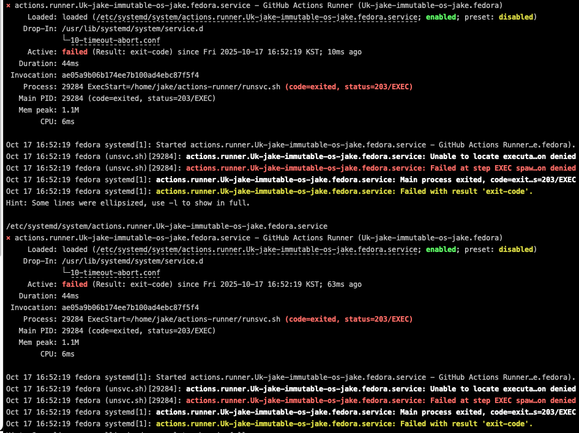

# 4주차 과제
## 작업 과정

1. Fedora VM 생성
2. Self-hosted Runner 등록
3. Github Secret 등록 (Quay.io Robot Account)
4. 워크 플로우 작성
    
    ```yaml
    name: CI (self-hosted) - Podman build & bootc
    
    on:
      push:
        paths:
          - "Containerfile"
          - "config.toml"
          - ".github/workflows/ci-podman.yml"
      workflow_dispatch:
    
    env:
      IMAGE: quay.io/mag0225/jake-fedora-bootc:latest
    
    jobs:
      build:
        runs-on: [self-hosted, linux, build]
    
        steps:
          - name: Checkout
            uses: actions/checkout@v4
    
          - name: Login to Quay (podman)
            run: |
              podman login quay.io \
                -u "${{ secrets.QUAY_USERNAME }}" \
                -p "${{ secrets.QUAY_PASSWORD }}"
    
          - name: Podman build & push
            run: |
              podman build -f ./Containerfile -t "$IMAGE" --pull=always .
              podman push "$IMAGE"
    ```
    

## 1. Trouble Shooting



### 문제 상황

**오류 로그**

```yaml
actions.runner...: Unable to locate executable... Permission denied
actions.runner...: Failed at step EXEC spawning /home/jake/actions-runner/runsvc.sh: Permission denied
status=203/EXEC
```

`sudo ./run.sh`로 직접 실행하면 정상 작동되었지만 systemd 서비스로 실행할 때 위와 같은 오류 발생

**문제 원인**

- 리눅스에는 “파일 권한”이 아닌 “보안 영역”도 존재
- SELinux(Security Enhanced Linux)가 보안 영역을 존재 - 방화벽같은 존재임
- `/home` 은 사용자 영역, SELinux 정책상 systemd파일이 실행되지않게 설정됨

즉, SELinux가 신뢰할 수 없는 경로에서 실행되는 것을 막음.

### 문제 해결 방법

1. 신뢰 가능한 경로인 `/opt` 하위로 이동
    
    ```yaml
    sudo mv /home/jake/actions-runner /opt/actions-runner
    sudo chown -R jake:jake /opt/actions-runner
    ```
    
2. SELinux 컨텍스트 복구
    
    ```yaml
    sudo restorecon -Rv /opt/actions-runner
    ```
    

---

### TMI) Github ←→ Self-hosted Runner 흐름

GitHub Actions의 핵심은 GitHub 서버 ↔ Runner 간의 양방향 통신.

Runner가 주기적으로 GitHub에 연결해서 작업이 있는지 묻는 방식(Pull 방식).

1. 트리거 발생 : `push`, `workflow_dispatch` 트리거 발생
2. 어떤 Runner가 실행할지 결정
    - WorkFlow Yaml 파일의 `runs-on` 을 확인해서 Runner 결정
    - Runner와 Github는 이미 WebSocket으로 연결 중
3. Runner가 로컬에서 Job 실행
    - 실행 로그, 결과를 실시간으로 GitHub로 스트리밍 업로드
4. GitHub Actions UI에서 결과 확인